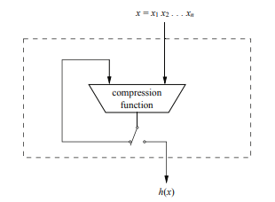
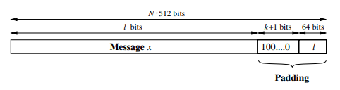
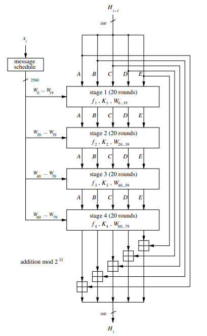
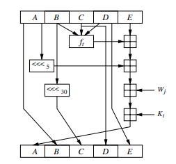
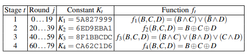

# Hash Functions

- Os principais métodos de assinatura digital conhecidos e 
implementados atualmente não permitem que a mensagem objeto
da assinatura seja muito grande.
    - Para RSA, por exemplo, as mensagens não podem ser maiores
    do que o primo 'p' selecionado.
    - Possível solução seria utilizar modo ECB para assinar
    blocos separados de mensagens grandes. Porém, é uma solução
    problemático, já que:
        - Métodos de assinatura digital são extremamente custosos
        computacionalmente, visto que dependem de um grande 
        número de exponenciações com valores grandes
        - Criar uma assinatura do tamanho da mensagem implica
        em dobrar o seu tamanho. Portanto, um arquivo de 1GB
        teria uma assinatura de 1GB
        - Inseguro, pois um atacante poderia interferir em
        blocos individuais da assinatura, removendo-os ou
        reoordenando-os.
    - Solução é hashing, pois comprime mensagens de tamanhos
    variados para um tamanho padrão estipulado
        - Hashing cria uma "digital" para mensagens
        - Deve ser eficiente para poder calcular hashing de 
        mensagens grandes
        - Deve ter um tamanho fixo padrozinado, independente
        do tamanho da mensagem de entrada
        - Deve ser extremamente sensível à difusão, ou seja, 
        alterar um bit da entrada deve implicar em uma mudança
        drástica no seu hash.

- Segurança
    - Resistência de preimagem (one-wayness):
        - Dado um hash z = h(x), deve ser computacionalmente
        impossível determinar x. 
            - Se a função de hash não é de uma-via, atacantes são 
            capazes de observar os valores transmitidos e descobrir
            o conteúdo, de modo a quebrar o esquema.
    - Resistência de segunda preimagem ou Resistência de Colisão Fraca
        - Dado x1, é computacionalmente impossível encontrar uma
        outra mensagem x2 tal que h(x1) = h(x2).
            - Um atacante poderia interferir na mensagem (x1, s) 
            enviada, e enviar uma segunda mensagem (x2, s) tal que 
            h(x1) = h(x2), fazendo com que a assinatura de ambas 
            sejam iguais e com que receptor seja incapaz de reconhecer
            a fraude no sistema.
        - Impossível de garantir que cada mensagem existente possua 
        um hash único devido o princípio da casa dos pombos.
            - Como impossível de evitar teoricamente, a solução é
            evitar na prática, aumentando o tamanho do output da função,
            de modo que é computacionalmente impossível realizar o
            número de operaões necessárias para encontrar uma colisão
    - Resistência de colisão
        - Garante que é computacionalmente impossível encontrar duas 
        mensagens x1 e x2 arbitrárias tais que h(x1) = h(x2).
            - Mais complicada que colisão fraca, pois o atacante pode
            escolher qualquer mensagem que quiser para iniciar o ataque
            - Dado x1, atacante pode alterar espaços em branco para 
            que o hash seja igual ao de x2.
                - Substituir espaços por tabs, adicionar espaços no 
                final, etc.
                    - Se tem 64 posições para editar, possui 2⁶⁴ casos.
        - Pelo paradoxo do aniversário, são necessárias apenas 2ⁿ/² 
        operaçõespara encontrar uma colisão, sendo n o tamanho do 
        output da função.

- SHA-1
    - Funções de hash podem ser baseadas em cifras de bloco ou podem
    ser construídas puramente dedicadas ao hashing em si.
        - Mas, independentemente do tipo, todas são baeadas em uma
        função de compressão, na qual ao longo de múltiplas iterações,
        blocos da mensagem original são repassadas pela função, 
        influenciando no resultado final. 
            - Tal estilo de design é chamado de "Merkle-Damgard construction"
        
    - Função de hash mais famosa e adotada na prática
    - Saída padronizada para 160 bits, com entrada máxima de 2⁶⁴ bits. 
    A função de compressão recebe blocos de 512 bits e consiste em 80 
    rodadas divididas em 4 estágios de 20 rodadas cada.
    - Pré-processamento
        - A mensagem passa por um preenchimento para que seu tamanho
        seja um múltiplo de 512, e, assim, possa ser dividas em blocos
        exatos.
        - Preenchimento é composto por um bit '1', k bits '0' e a 
        representação em 64 bits do tamanho 'l' do bloco em questão.
            
            - k = 512 - 64 - 1 - l mod 512 ≡ 448 - (l + 1) mod 512
        - Cada um dos blocos de 512 bits é dividido em 16 palavras
        de 32 bits cada, e o valor inicial H₀ é constante.
    - Computação do Hash
        - O bloco de 512 bits passa por uma rotina de mensagens que 
        deriva 80 palavras de 32 bits a partir das 16 que o compõem,
        uma para cada rodada
        - Necesita-se de 5 registradores de 32 bits cada que irão ser
        usados para o transporte dos resultados de uma rodada para a 
        outra e de um estágio para o outro
        - Existe um valor de hash Hᵢ, que representa o hash de cada
        bloco de 512 bits. No início é a constance citada, e, no final,
        é o hash da mensagem x.
        
        - Cada estágio usa uma função fₜ e uma constante Kₜ diferente,
        com 1 <= t <= 4, e é composto por 20 rodadas
        
        
            - As operações das funções de cada rodada são binárias, 
            permitindo implementações extremamente rápidas.
        - Pode-se afirmar que as rodadas de SHA-1 apresentam uma 
        estrutura semelhante à uma rede de Feistel generalizada