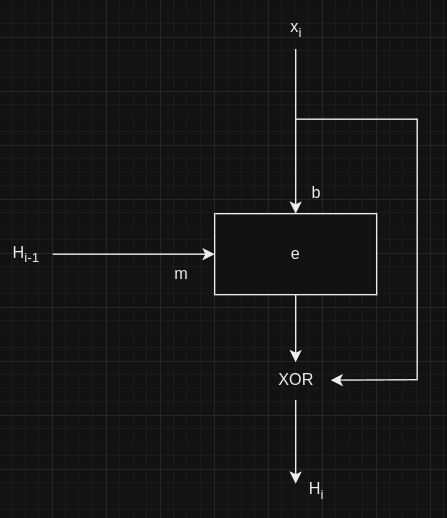
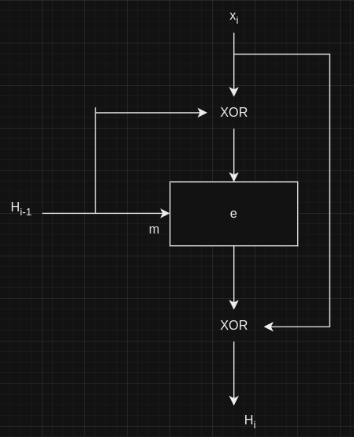

# Respostas

## 11.1.1)
Dados iniciais:
x = {0...00} (len = 512)
W[] = {0...00} (len = 2560)
H₀ = 00...00 (len = 160)
W₀ = 00.00 (len = 32)

Round 1:
B₁ = A₀ = 00...00 (len = 32)
C = (B)<<<₃₀ = 00...00 (len = 32)
D₁ = C₀ = 00...00 (len = 32)
E₁ = D₀ = 00...00 (len = 32)
A₁ = (E₀ + f(B₀, C₀, D₀) + (A₀)<<<₅ + W₀ + K₀) = 
==> f(B₀, C₀, D₀) = (B ∧ C) ∨ (~B ∧  D) = 
    = {00...00} ∨ {00...00} = {00...00}
==> A₀<<<₅ = {00...00}
∴ A₁ = ({00...00} + {00...00} + {00..00} + {00...00} + K₀) =
    = (00...00 + 5a827999) = 5a827999

Output:
∴ out = 5a827999 00..00 00..00 00..00 00..00

## 11.1.2)
Problema não vai ser mudado, pois o único bit alterado é o bit 512.
Assim, ao passar pela divisão da mensagem e pelo message schedule, 
a única palavra de 32 bits das 16 primeiras diferente da do exercício
anterior será W₁₅, não utilizada no primeiro round.
∴ out = 5a827999 00..00 00..00 00..00 00..00

## 11.2.1)
O ataque A permite a quebra da segurança do sistema de armazenamento 
de senhas, já que, ao quebrar a propriedade de via-única da função de
hash 'h', o hacker consegue encontrar qualquer senha 'x' a partir do
h(x) armazenado. Consequentemente, tendo qualquer senha, o sistema não
é mais seguro.
O ataque B também é suficiente para a quebra da segurança, já que quebrar
a propriedade de segunda preimagem garante que, dado um x1, o indivíduo
é capaz de achar x2 tal que h(x1) = h(x2). No entanto, nota-se que o 
hacker, não precisa ter x1 por si só. Ao ter acesso ao h(x1), sendo x1 
a senha do usuário vítima do ataque, se o hacker achar outra senha com o
mesmo hash, consegue acessar o sistema sem sequer saber o valor de x1.
Isso, pois o sistema, ao receber o input da senha, calcula seu hash e 
compara-o com aquele armazenado. Então, se h(x2) = h(x1), ao inputar x2,
o sistema de segurança irá verificar que o hash está correto e garantir
acesso à conta, representando, portanto, uma quebra do sistema.
Já o ataque C não se torna muito útil na situação detalhada, já que 
busca-se uma forma de encontrar x ou h(x). Assim, achar colisões para 
dois xᵢ arbitrários não garante que haverá uma quebra do sistema de segurança.
Seria apenas suficiente se, por sorte, o hash igual encontrado fosse,
também, por muita coincidência e sorte, o hash de uma das senhas armazenadas.
Ainda sim, o hacker não teria como saber, se não tentasse inputar o 
valor encontrado.

## 11.2.2)
Adicionar um salt no início da senha antes do hashing aumenta a segurança
do sistema de armazenamento de senhas, já que, assim, o hash guardado
não será diretamente associado ao da senha. Desse modo, se um hacker
realizar o ataque B e encontrar um x2 tal que h(x2) = h(x), ainda sim
não terá acesso à conta associada à senha. Isso, pois quando tentar
realizar o login com a senha falsa x2, o sistema calculará o hash dela
quando concatenada ao salt guardado, o que resultará em um hash diferente
do h(x2), e, consequentemente, diferente do hash armazenado. Já o 
ataque A, quando realizado em um sistema que utiliza salt, deixa de ser
eficiente, já que, mesmo realizando h⁻¹(z), o valor encontrado será de
salt||x, isto é, a senha concatenada com o valor aleatório salt. Então,
se o ataque for implementado para testar senhas automaticamente, o que
é o mais provável de acontecer em um cenário real, ele falhará, já que 
a tentativa de input será salt||x, e não a senha em si. Consequentemente,
o sistema de verificação gerará um hash diferente e portanto será inválido.
No entanto, se o hacker avaliar manual e visualmente, há uma chance de
poder diferenciar o salt da senha, visto que tem acesso ao primeiro, e,
portanto, conseguir acesso à conta.

## 11.2.3)
Como visto ao longo do capítulo, um hash com output de 80 bits, para
ataques de segunda preimagem, isto é, o ataque B; garantem a segurança
do sistema. Porém, pelo princípio de Kerckhoff, o ideal seria aumentar
o tamanho da saída da função para 128 bits, pois assim, não há computador
capaz de quebrar o esquema.

## 11.3.1)
//Todos muito semelhantes, portanto, fiz 2 apenas

## 11.3.4)

## 11.5)
Temos pelo capítulo que a fórmula para o número de hashes t para uma 
colisão com probabilidade λ é:
t = 2⁽ⁿ⁺¹⁾/² * sqrt(ln(1 / (1 - λ)))

- ϵ = 0.5:
Se len(out) = 64, t ≈ 3575794827
Se len(out) = 128, t ≈ 1.53e+19
Se len(out) = 160, t ≈ 1.00e+24

- ϵ = 0.1:
Se len(out) = 64, t ≈ 1394115657
Se len(out) = 128, t ≈ 5.98e+18
Se len(out) = 160, t ≈ 3.92e+23

## 11.6)
Primeiramente, se eu estivesse buscando um x2 dado um x1, geraria, em 
loop, um valor aleatório e checaria se ele já foi gerado. Caso positivo,
gero um novo. Caso negativo, o compararia com o hash de x1 buscado.
Se houver colisão, a busca está encerrada. Mas, caso não, armazenaria
o valor de x2 gerado para acelerar o algoritmo e impedir a geração de
duplicatas. Desse modo, armazenaria apenas os 't' valores de x2 gerados,
juntamente com o x1 e o seu hash, resultando em um custo de memória
de (t + 1) * m + n, sendo 'n' o tamanho do output e m o tamanho do
input, ambos em bits.
Caso estivesse procurando apenas uma colisão para valores de x1 e
x2 quaisquers, geraria primeiramente um x1 aleatório e começaria a 
busca. Assim, em loop, criaria um x2 de valor aleatório e checaria
se ele já não foi gerado (para isso, precisaria armazenar todos os x2).
Caso positivo, geraria um novo. Caso negativo, calcularia h(x2) e 
compararia o valor obtido com todos os hashes armazenados até então.
Se houver colisão, o algoritmo está finalizado. Caso contrário, guardaria
tanto o valor de x2 quanto de h(x2) para fins de comparação. Assim, 
aumentos as chances conforme o ataque probabilístico do aniversário, 
já que comparo o hash obtido não só com um outro, e sim com todos os
calculados até então. Com tal raciocínio, teria que armazenar todos
os 't' x2 gerados juntamente aos seus 't' hashes, x1 e h(x1). Implica-se,
portanto, em um custo de memória de (t + 1) * m + (t + 1) * n bits, i.e.,
(t + 1) * (m + n) bits.