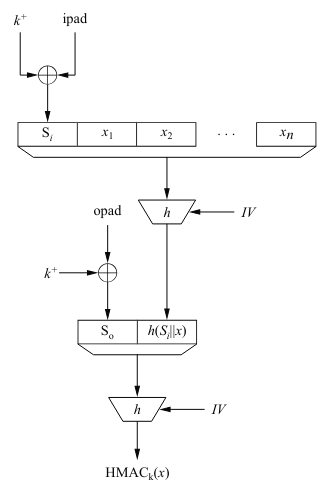
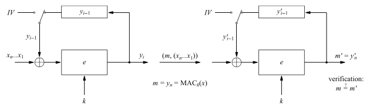

# Message Authentication codes (MACs)

- MACs são muito similares à assinaturas digitais, sendo muito
utilizados na prática na implementação de protocolos
    - Assim como assinaturas digitais, oferecem integridade e
    autenticação. No entanto, não garantem não repudiação
        - Utilizados em sua maioria quando a maior preocupação
        é a garantia da autenticidade da mensagem ao longo da
        transmissão
    - Assim como assinaturas digitais, concatenam uma tag de
    autenticação 'm' à mensagem 'x', sendo a tag feita a partir
    da própria mensagem.
        - Diferentemente, utilizam criptografia simétrica para
        a geração de 'm', o que remove a garantia de não repudiação
        - Também possuem tamanho fixo de saída, mesmo tendo 
        tamanho de entrada arbitrário
    - Por ser baseado em criptografia simétrica, a verificação
    envolve o mesmo processo que a autenticação. O receptor passa
    'x' pela função de MAC e gera um m'. Se m' = m, a mensagem é
    aceita.

- MACs construídos a partir de funções de Hash (HMAC)
    - Muito utilizado na prática em protocolos de internet
    - A ideia é que a chave simétrica é concatenada à mensagem e,
    juntas, passam pela função de hash, gerando m = MACₖ(x)
        - Prefixo secreto: m = MACₖ(x) = h(k||x)
            - Não é seguro contra ataques que exploram a propriedade
            do prefixo
            - Suponhamos que Bob enviou (x, m) para Alice, sendo
            x = (x1,..., xₙ) e m = (h||x1,..., xₙ). Oscar pode 
            interceptar a mensagem e concatenar um bloco arbitrário
            xₙ₊₁ tal que xO = (x1,..., xₙ, xₙ₊₁) e mO = h(m||xₙ₊₁).
            Quando Alice receber o par (xO, mO), sua verificação
            m' = h(k||x1,..., xₙ, xₙ₊₁) = mO será válida.
                - Tal ataque se baseia no fato de que funções de hash
                são baseadas em iterações nas quais o output da rodada
                k é o input da rodada k+1. Assim, como m originalmente
                era o último input de h(k||x1,..., xₙ), calcular mO
                como h = (m||xₙ₊₁) é o equivalente a ter calculado desde
                o início h(k||x1,..., xₙ, xₙ₊₁).
        - Sufixo secreto: m = MACₖ(x) = h(x||k)
            - Não seguro para casos em que é possível encontrar uma 
            colisão na função de hash.
            - Se um atacante descobre um xO, tal que h(x) = h(xO), o 
            MAC m = h(x||k) também é válido para h(xO||k).
                - Evitado facilmente caso os parâmetros da função de
                hash sejam escolhidos corretamente.
    - Construção mais segura é chamada de HMAC
    
        - Chave k é expandida com zeros à esquerda tal que k⁺ tem 
        tamanho b (tamanho do bloco de entrada da função de hash).
        - Chave passa por XOR com um padding interno (ipad). O 
        resultado é concatenado à mensagem, que passa pela função 
        de hash em si. O ouput desse hash, concatenado ao XOR da 
        chave k expandida com um padding externo (opad), passa por
        h() novamente, gerando o HMACₖ(x).
            - Extremamente eficiente, já que são realizadas apenas
            duas passagens pela função de hash, sendo a segunda 
            composta apenas por dois blocos.
            - É segura por prova, ou seja, é "provable secure". Assim,
            HMAC não é seguro per se, mas se baseia na segurança dos
            blocos em que sua construção é baseada.
                - Se um atacante consegue quebrar HMAC, significa
                que consegue quebrar a função de hash que é baseado.

- MACs construídos a partir de cifras de blocos
    - Método mais comum é utilizar AES no modo CBC. Assim, é chamado
    de CBC-MAC
    
        - A mensagem 'x' é dividida em blocos. Assim, todos passam
        pelo sistema, assim como no CBC, tal que yᵢ = eₖ(xᵢ⊕yᵢ₋₁).
        No final, temos que m = MACₖ(x) = yₙ
            - Diferentemente da encriptação por CBC, todos os outros 
            blocos gerados y1, y2, ..., yₙ₋₁ não são transmitidos.
        - Verificação é uma repetição das operações utilizadas para
        a geração do MAC.
    - Galois Counter Message Authentication Code (GMAC)
        - Menos comum, mas ainda muito prático por ser facilmente
        paralelizável. Assim, é interessante para aplicações que 
        necessitam de velocidade.
