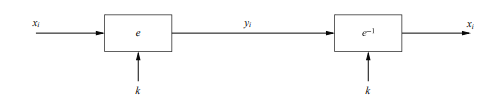
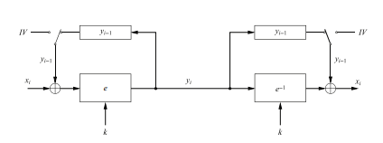
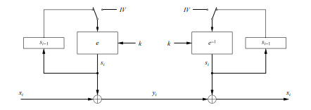
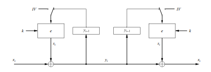
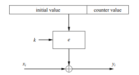
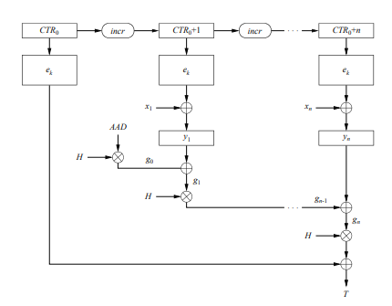

# Notes
ECB (Eletronic Codebook Mode):
- Modo intuitivo de encriptação: passar todos os plaintexts, 
    um seguido do outro, pela cifra em bloco. Decriptação é
    basicamente o processo reverso
- Determinístico e facilmente manipulável.

CBC (Cipher Block Chaining Mode):
- A ideia é que todos os blocos de ciphertexts dependam do 
    plaintext associado e, também, de outros ciphertexts encriptados
    anteriormente. Para isso, o ciphertext yᵢ₋₁ é utilizado em 
    uma operação de XOR com o plaintext de entrada xᵢ. Em seguida,
    na próxima iteração, o input é um XOR entre o ciphertext gerado
    na iteração passada yᵢ com o plaintext xᵢ₊₁. Assim, um bloco yₖ 
    depende tanto do xₖ quanto de todos os outros yₖ₋ₙ anteriores.
- Necessita de um IV (Initialization Vector) para a primeira 
    iteração
- Decriptação é, novamente, o processo reverso, ou seja:
    xᵢ = eₖ⁻¹(yᵢ) XOR yᵢ₋₁
- Não determinístico desde que IV seja um nonce.
- IV não precisa ser secreto.

OFB (Output Feedback Mode):
- Raciocínio semelhante ao de CBC, porém simula uma cifra de 
    fluxo. Dessa vez, o que é passado pela cifra de bloco é o 
    seu próprio output da iteração anterior. Assim, o output
    da cifra sᵢ passa por um XOR com o plaintext xᵢ da iteração,
    realizando de fato a encriptação do processo.
- Na primeira iteração também necessita de um IV
- Não é determinístico, desde que o IV seja um nonce, ou seja
    seja usado apenas uma vez para cada encriptação.
- Nota-se que a encriptação (XOR com plaintext) é independente
    das passagens pela cifra de bloco. Assim, os outputs da cifra
    de bloco podem ser calculados previamente, de modo a agilizar
    o processo.

CFB (Cipher Feedback Mode):
- Semelhante ao OFB, porém, ao invés de passar o output sᵢ da 
    cifra como input da próxima iteração, o próprio ciphertext 
    yᵢ é passado como entrada. O restante do processo funciona
    semelhantemente ao OFB.
- Não determinístico
- Necessita de um IV nonce.

CTR (Counter Mode):
- Funcionamento simples, em que o output da cifra de bloco 
    realiza um XOR com o plaintext da iteração. No entanto, a 
    diferença está na entrada da cifra de bloco. Aqui, parte do
    IV (por exemplo, 1/4 dos bits) é um contador, que, para 
    cada iteração, é incrementado, mantendo o restante do IV 
    constante.
- Utilizando AES com um contador de 32 bits, temos que a entrada
    envolve 96 bits do IV e 32 bits do contador. Assim, é possível
    realizar 2³² encriptações em bloco antes de ser necessário trocar
    o IV. Como o bloco tem 8 bytes, nesse caso, pode-se encriptar
    2³⁵ bytes (32 Gigabytes) antes da troca.
- O IV, juntamente ao Counter não precisa ser secreto
- O counter pode ser simples, começando no 0 e sendo incrementado 
    em 1 a cada iteração, por exemplo; ou pode ser implementado
    de forma mais complexa, utilizando registrados de shift, por 
    exemplo.
- Pode ser paralelizado, pois uma iteração não depende de outras.
    Assim, podemos ter, por exemplo, duas cifras de bloco, uma para
    as iterações pares, e outra para as iterações ímpares.

GCM (Galois Counter Mode):
- Modo um pouco mais complexo, mas que permite a geração de um
    MAC juntamente à encriptação.

