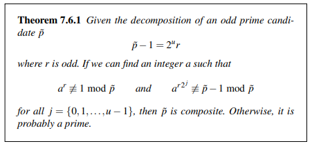
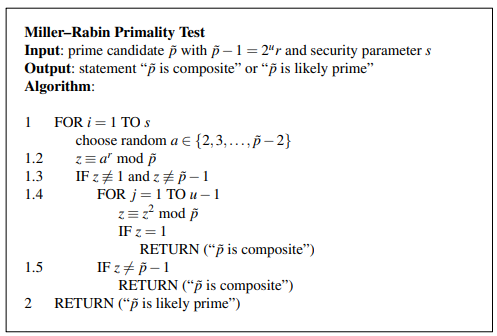

# Notes
--> Primeiro esquema de criptografia de chave pública
    --> Baseado no problema de fatoração de inteiros
        --> Muito fácil calcular o produto de dois números
            inteiros 'p' e 'q', mas muito difícil de achar
            os fatores de 'n', isto é, inteiro resultante
            do produto entre 'p' e 'q'.

--> kₚᵤ = (n, e) && kₚᵣᵢᵥ = (d)
    --> Selecionar dois primos suficientemente grandes 'p'
        e 'q'
    --> n = p * q
    --> Calcular Φ(n) = (p - 1)(q - 1)
    --> Selecionar 'e' como inteiro pertencente ao invervalo 
    [1, Φ(n) - 1]
        --> gcd(Φ(n), e) == 1 
        --> d = e⁻¹ mod Φ(n)
    --> Encriptação é feita realizando y = xᵉ mod n
    --> Decriptação é feita realizando x = yᵈ mod n

--> Chaves do RSA possuem, no geral, 1024 bits de comprimento,
    fazendo com que potenciação com tais fatores seja
    extremamente custoso e demorado
    --> Método eficiente envolve analisar os bits do expoente
        em base binária
        --> Iteração ao longo dos bits, começando pelo MSB.
            Para cada iteração, o resultado atual é elevado
            ao quadrado. Caso o bit da iteração seja = 1,
            o resultado atual é multiplicado pelo x inicial
        --> Realizar a potenciação de um número x por um 
            expoente 'e' com comprimento igual a 1024 bits
            necessitaria de 10³⁰⁰ multiplicações. Com o método acima, apenas 1,5t, onde t é o comprimento
            em nits do expoente.

--> Ainda sim, RSA é muito custoso e demorado.
    --> Para acelerar a encriptação, é comum utilizarem 
        valores pequenos para os expoentes públicos 'e'.
        --> Esquema continua seguro mesmo com tal 
            característica
    --> Para acelerar decriptação, utilizam propriedades
        do Teorema Chines dos Restos
        --> Mais fácil realizar potenciação com dois expoentes
            médios do que com um grande.
        --> xₚ = x mod p && xq = x mod q
        --> dₚ = d mod (p - 1) && dq ₌ d mod (q - 1)
        --> yₚ = xₚᵈ mod p && yq = xqᵈ mod q
        --> cₚ = q⁻¹ mod p && cq = p⁻¹ mod q
        --> y = [q * cₚ] * yₚ + [p * cq] * yq mod n
        --> Speedup de 4x

--> Principal métoo para encontrar prmios é o teste de 
    primalidade de Miller-Rabin
    --> Utiliza-se um parâmetro se segurança 's' para 
        realizar múltiplas iterações em cima do mesmo
        número, de modo a diminuir as chances do número
        ser um número composto e o teste apresente como 
        saída um falso positivo.

--> RSA, se implementado apenas como apresentado acima, 
    apresenta muitos problemas
    --> Determinístico
    --> Plaintexts x = 0, x = 1 ou x = -1 geram ciphertexts
        iguais a 0, 1 ou -1
    --> Certos expoentes públicos pequenos possuem fraquezas
        matemáticas por natureza
    --> É maleável, ou seja, um atacante é capaz de alterar
        o ciphertext y, de modo que o plaintext gerado após
        a decriptação é diferente do que gerou o ciphertext, 
        ou seja, do original.
        --> Principal solução é utilizar padding.
            --> Padrões de criptografia afirmam que RSA só
                é seguro caso implementado com algum padrão
                já estabelecido de padding.

--> Não há nenhum ataque conhecido mais eficiente do que
    fatorar o número n.
    --> É necessário, pois para achar a chave privada 'd',
        um atacante precisa de Φ(n), que, até então, o método
        mais rápido conhecido para se achar é através dos
        fatores 'p' e 'q' de 'n'.
