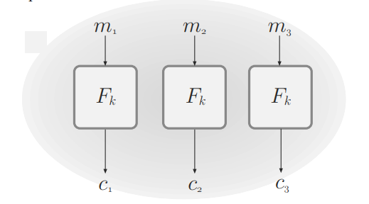
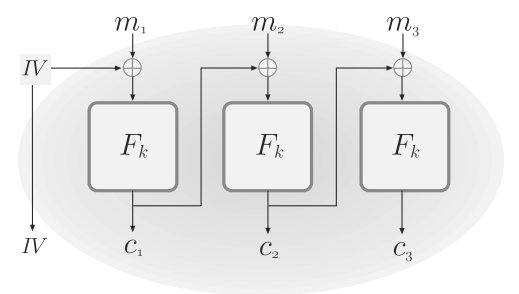
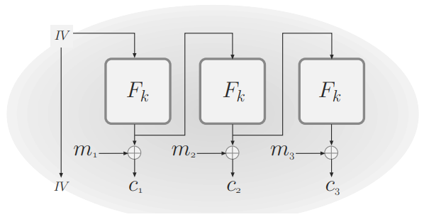
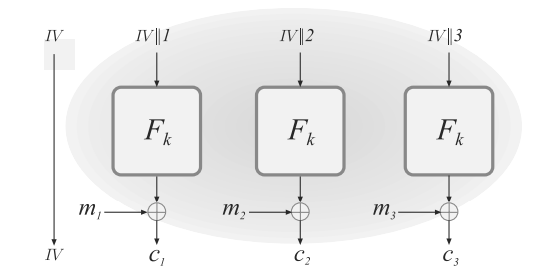

# Private-Key Encryption

- ## 3.1 - Segurança Computacional
	- Sigilo perfeito impõe que deve ser impossível que um atacante com tempo ilimitado e poder computacional infinito consiga obter qualquer informação sobre uma mensagem encriptada enviada
		- Na prática, tal rigor é desnecessário, já que não há nenhum indivíduo que tenha tamanho poder sob suas mãos.
		- Relaxamentos
			- Segurança apenas precisa ser garantida contra atacantes eficientes e com tempo limitado, já que na prática há um limite para poder computacional
			- Um esquema não precisa ser 100% a prova de vazamentos, já que uma baixíssima probabilidade de falha ainda é irrelevante.
	- ### 3.1.1 - Abordagem concreta
		- Quantifica explicitamente os limites de um esquema criptográfico
		- **Definição**: um esquema é (*t*, $\epsilon$)-seguro se qualquer adversário que roda no máximo em tempo *t* consegue quebrar o esquema com probabilidade máxima $\epsilon$.
		- Limitada, pois garantias concretas são difíceis de serem aplicadas universalmente, já que cada indivíduo potencialmente malicioso esta sujeito à diferentes condições
	- ### 3.1.2 - Abordagem assintótica
		- **Definição:** Um esquema criptográfico é seguro se qualquer adversário probabilístico de tempo polinomial (PPT) consegue quebrar o esquema com no máximo uma probabilidade insignificante.
		- Define os parâmetros de segurança de um esquema em função de um polinômio associado ao tamanho da chave.
			- Possível mexer na função para configurar o esquema de acordo com os níveis procurados de segurança
		- Em muitos casos, avanços no poder computacional disponível, se feitos por ambas partes (indivíduos honestos e indivíduos maliciosos), tornam o esquema ainda mais complicado de ser quebrado.
		- Definições relacionadas:
			- Função polinomial
				- Uma função *f* é dita polinomial se existe uma constante *c* tal que *f(n)* < *nc* para qualquer *n*.
			- Algoritmo polinomial
				- Um algoritmo *A* é dito polinomial se existem um polinômio *p* tal que para qualquer input *x* $\in$ {0, 1}*, *A(x)* é finalizado em no máximo *p(|x|)* passos.
			- Algoritmo probabilístico
				- Um algoritmo é dito probabilístico se possui acesso à uma sequência de bits randômicos e independentes.
			- Função insignificante
				- Uma função *f* *R* -> *R+* é dita insignificante se $\forall$ polinômio *p* $\exists$ *N* tal que $\forall$ *n* > *N*, *f(n) < 1/p(n)* 
				- Equivalentemente, para qualquer contante *c*, existe um *N* tal que para todo *n* > *N*, *f(n) < n-c*.
				- Propriedades
					- Se *negl1* e *negl2* são funções insignificantes, então *negl3* = *negl1 + negl2* também é insignificante
					- Para qualquer polinômio *p*, a função *negl4* = *p * negl1* também é insignificante
					- Se uma função *g* não é insignificante, então a função *f = g / p* também não será, para qualquer polinômio *p*.

- ## 3.2 - Encriptação Computacionalmente Segura
	- Um **esquema criptográfico de chave privada** consistem em um conjunto de três algoritmos PPT:
		- **Gen():** recebe como entrada uma string 1n referente ao parâmetro de segurança do esquema e dá como saída uma chave *k* aleatória.
		- **Enc():** recebe como entrada uma chave *k* e uma mensagem *m* $\in$ {0, 1}* e devolve como saída um ciphertext *c*
		- **Dec():** recebe como entrada uma chave *k* e um ciphertext *c* e devolve como saída uma mensagem *m* ou uma mensagem de erro
			- É obrigatório que $\forall$ *n*, $\forall$ *k*, $\forall$ *m*, **Deck(Enck(*m*))** == *m*
			- Pode-se assumir **Dec()** como um algoritmo determinístico
	- ### 3.2.1 - Segurança-EAV
		- **Definição:** Um esquema criptográfico $\Pi$ = (**Gen**, **Enc**, **Dec**) tem **encriptações indistinguíveis na presença de ouvintes escondidos** (é **EAV-seguro**) se para qualquer adversário *A* PPT, existe uma função insignificante *negl* tal que, $\forall$ n, **P[PrivKA, Πeav (n) = 1] $\le$ 1/2 + negl(n)**
		- **Definição:** Um esquema criptográfico $\Pi$ = (**Gen**, **Enc**, **Dec**) tem **encriptações indistinguíveis na presença de ouvintes escondidos** (é **EAV-seguro**) se para qualquer adversário *A* PPT, existe uma função insignificante *negl* tal que **P[outA(PrivKA, Πeav(n, 0)) = 1] - P[outA(PrivKA, Πeav(n, 1)) = 1]| ≤ negl(n)**
	- Existem casos em que descobrir o tamanho do plaintext revela informações sobre o mesmo. Portanto, deve-se analisar se o esquema a ser implementado permite mensagens de tamanho arbitrário e se o contexto torna o tamanho das mensagens algo sensível
	- ### 3.2.2 - Segurança Semântica
		- **Teorema 3.10:** Seja $\Pi$ = (**Enc**, **Dec**) um esquema criptográfico de chave privada de tamanho fixo para mensagens de tamanho *l* que é EAV-seguro. Então para qualquer adversário adversário *A* PPT e *i* $\in$ {1, ..., *l*}, existe uma função insignificante *negl* tal que **P[*A*(1n, Enck(*m*)) = *m*i] $\le$ 1/2 + negl(*n*)
		- **Teorema 3.11:** Seja $\Pi$ = (**Enc**, **Dec**) um esquema criptográfico de chave privada de tamanho fixo para mensagens de tamanho *l* que é EAV-seguro. Então para qualquer algoritmo *A* PPT, existe um algoritmo *A'* PPT tal que para qualquer distribuição *D* sobre {0, 1}l e qualquer função *f*: {0, 1}l $\rightarrow$ {0, 1}, existe uma função insignificante *negl* tal que **|P[*A*(1n, Enck(*m*)) = *f*(*m*)] - P[*A'*(1n) = *f*(*m*)]| $\le$ negl(*n*)**
			- Isso significa que, dado um esquema criptográfico EAV-seguro, se existe um algoritmo adversário *A* capaz de computar corretamente com alguma probabilidade *f*(*m*) dado Enck(*m*), então existe um outro algoritmo adversário *A'* que também consegue computar *f(m)* com praticamente a mesma probabilidade sem ter acesso a Enck(*m*).
		- **Definição:** um esquema criptográfico (**Enc**, **Dec**) é **semanticamente seguro na presença de um ouvinte escondido** se para todo algoritmo *A* PPT existe uma algoritmo *A'* PPT, tal que para qualquer algoritmo *Samp* PPT e funções polinomiais *f* e *h*, a proposição segue que **|P[*A*(1n, Enck(*m*), *h*(*m*)) = *f*(*m*)] - P[*A'*(1n, |*m*|, *h*(*m*)) = *f*(*m*)]| $\le$ negl(*n*)**
			- Resumidamente, *A* tenta calcular *f*(*m*) dado o parâmetro de segurança, a encriptação da mensagem *m* e informações arbitrárias externas *h*(*m*). Já *A'* tenta calcular *f*(*m*) dado apenas o parâmetro de segurança, o tamanho da mensagem e as informações externas. A definição garante que a diferença de probabilidade de acerto de ambos algoritmos adversários é insignificante.
		- **Teorema 3.13:** Um esquema criptográfico é EAV-seguro $\iff$ é semanticamente seguro.

- ## 3.3 Construção de esquemas criptográficos EAV-seguros
	- ### 3.3.1 Geradores de números pseudoaleatórios
		- A ideia é utilizar uma pequena quantidade de números aleatórios (*seed*) para gerar uma grande quantidade de números pseudoaleatórios.
		- Para que uma distribuição *D* seja uma boa distribuição pseudoaleatória, qualquer amostra dela deve ser indistinguível de uma amostra uniforme para um observador polinomial
			- Não faz sentido chamar uma string de pseudoaleatória, já que se trata de uma característica para uma distribuição de strings.
		- **Definição:** Seja *G* um algoritmo polinomial determinístico tal que $\forall$ *n* e $\forall$ *s* $\in$ {0, 1}n, *G(s)* retorna uma string de tamanho *l(n)*. *G* é **pseudoaleatório** $\iff$ 
			- (Expansão): $\forall$ *n*, *l(n)* > *n* 
			- (Pseudoaleatoriedade): Para todo algoritmo *D* PPT, existe uma função insignificante *negl* tal que **|P[*D*(*G*(*s*)) = 1] - P[*D*(*r*) = 1]| $\le$ *negl*(*n*) 
		- É trivial diferenciar uma string verdadeiramente aleatória de uma string pseudoaleatória dado tempo ilimitado com um algoritmo exponencial.
			- Se *G* recebe uma *seed* de tamanho *n* e devolve uma string de tamanho 2*n*, significa que *G* consegue gerar no máximo 2n strings de tamanho 2*n*, sendo que, obviamente, existem 22n strings de tamanho 2*n*.
	- Utilizar reduções em provas e análises de segurança de esquemas criptográficos é um método extremamente prático. A ideia é provar que um esquema criptográfico é seguro assumindo que, por exemplo, um algoritmo *G* é um gerador pseudoaleatório, ao invés de provar a segurança incondicional de uma construção.
		- Permite que a base da prova de segurança esteja relacionada à uma primitiva de baixo nível (e.g. distribuição válida de um gerador pseudoaleatório) ao invés de ter que provar a segurança de todo o esquema criptográfico
		- Permite que a construção do esquema seja facilitada, já que é muito mais simples formular uma primitiva do que um esquema de alto nível
		- Permite variabilidade na utilização e na instanciação do esquema criptográfico, pois dado que é seguro com um gerador pseudoaleatório, qualquer construção dessa primitiva pode ser implementada.

- ## 3.4 - Definições fortes de Segurança 
	- ### 3.4.1 - Segurança para encriptações múltiplas
		- Experimento de ouvinte escondido para múltiplas mensagens **PrivKA, Πmult(*n):**
			- Adversário *A* recebe como entrada o parâmetro de segurança 1n e devolve duas listas de tamanho igual, com *M0* = (*m0,1*, ..., *m0, t*) e *M1* =(*m1, 1*, ..., *m1, t*), tal que $\forall$ i, |*m0,i*| = |*m1,i*|
			- *k* $\leftarrow$ Gen(1n) e escolhe-se *b* $\in$ {0, 1}. $\forall$ i, *ci* $\leftarrow$ Enck(*mb, i*) tal que *C* = (c1, ..., ct) é dado para *A*
			- *A* escolhe *b'* tal que a saída do experimento é 1 $\iff$ *b'* = *b*, e 0 caso contrário.
		- **Definição:** Um esquema criptográfico $\Pi$ = (Gen, Enc, Dec) tem **múltiplas encriptações indistinguíveis perante um ouvinte escondido** se $\forall$ adversário *A* PPT existe uma função insignificante *negl* tal que **P[PrivKA, Πmult(*n*) = 1] $\le$ 1/2 + negl(*n*)**
		- Se um esquema criptográfico tem sua função de encriptação Enc determinística, tal esquema não tem segurança para múltiplas encriptações
	- ### 3.4.2 - Segurança-CPA
		- Experimento de indistinguibilidade contra CPA **PrivKA, Πcpa(*n):**
			- *k* $\leftarrow$ Gen(1n)
			- *A* recebe 1n e Enck(.) como oráculo e devolve *m0* e *m1* tal que |*m0*| = |*m1*| 
			- *b* é escolhido e *c* $\leftarrow$ Enck(*m*b) é devolvido para *A* 
			- O adversário *A* continua com seu acesso ao oráculo Enck(.) e devolve palpite *b'*
			- A saída do experimento é 1 $\iff$ *b'* = *b* e 0 caso contrário
		- **Definição:** Um esquema criptográfico $\Pi$ = (Gen, Enc, Dec) tem **encriptações indistinguíveis perante um CPA (é CPA-seguro)** se $\forall$ adversário *A* PPT existe uma função insignificante *negl* tal que **P[PrivKA, Πcpa(*n*) = 1] $\le$ 1/2 + negl(n)**
	- ### 3.4.3 - Segurança-CPA para múltiplas encriptações
		- Um oráculo LRk,b devolve *c* $\leftarrow$ Enck(*m*b), dadas duas mensagens *m0* e *m1* e um bit *b* escolhido uniformemente. Se *b* = 0, o adversário *A* sempre recebe a encriptação da mensagem da esquerda (nesse caso, *m0*), e caso *b* = 1, recebe a encriptação da mensagem da direita.
		- Experimento de indistinguibilidade contra CPA **PrivKA, ΠLR-cpa(*n):**
			- *k* $\leftarrow$ Gen(1n)
			- *A* recebe 1n e LRk,b(., .) como oráculo e devolve *m0* e *m1* tal que |*m0*| = |*m1*| 
			- *b* é escolhido e *c* $\leftarrow$ LRk,b(*m*b) é devolvido para *A* 
			- O adversário *A* continua com seu acesso ao oráculo LRk,b(., .) e devolve palpite *b'*
			- A saída do experimento é 1 $\iff$ *b'* = *b* e 0 caso contrário
		- **Definição:** Um esquema criptográfico $\Pi$ = (Gen, Enc, Dec) tem **encriptações múltiplas indistinguíveis perante um CPA (é CPA-seguro para encriptações múltiplas)** se $\forall$ adversário *A* PPT existe uma função insignificante *negl* tal que **P[PrivKA, ΠLR-cpa(*n*) = 1] $\le$ 1/2 + negl(n)
		- É possível simular um oráculo comum com um oráculo LR passando a mesma mensagem duas vezes, ou seja, chamando LRk,b(*m*, *m*)
		- **Teorema 3.23:** Todo esquema criptográfico que é CPA-seguro também é CPA-seguro para múltiplas encriptações

- ## 3.5 - Construção de esquemas criptográficos CPA-seguros
	- ### 3.5.1 - Funções pseudoaleatórias e permutações
		- Uma função chaveada *F*: {0, 1}* x {0, 1}* $\rightarrow$ {0, 1}* é uma função que representa todas as funções *F*k $\in$ *Func*n com *F*: {0, 1}n $\rightarrow$ {0, 1}n, tal que $\forall$ s $\in$ *S*, $\forall$ x $\in$ {0, 1}n, *F*s(x) = *F*(Ks, x), sendo *S* o espaço de chaves.
			- *F* é eficiente se existe um algoritmo polinomial que calcule *F*(k, x) para dado *k* e *x*.
			- *F* preserva tamanhos se o *l*k = *l*in = *l*out = n
		- Uma função *F*: {0, 1}n $\rightarrow$ {0, 1}n é considerada **pseudoaleatória** se *Fk*, dado um *k* uniforme, é indistinguível de uma função escolhida uniforme e aleatoriamente de *Func*n, sendo *Func*n o conjunto de todas as funções que mapeiam strings de *n* bits para strings de *n* bits.
		- Cada função *F*k: {0, 1}n $\rightarrow$ {0, 1}n pode ser enxergada como uma lookup-table em que cada posição da tabela guarda uma das strings possíveis de serem geradas por *F*k. Portanto, tal lookup-table tem *n* * 2n entradas.
		- **Definição:** Um função chaveada eficiente *length preserving* *F*: {0, 1}* x {0, 1}* $\rightarrow$ {0, 1}* é uma **função pseudoaleatória** se para qualquer diferenciador *D* PPT, existe uma função insignificante *negl* tal que **|P[*D*Fk(.)(1n) = 1] - P[*D*f(.)(1n) = 1]| $\le$ negl(*n*)**
		- (Checar primeiro exercício resolvido do capítulo)
		- Uma função *F*: {0, 1}lin(n) $\rightarrow$ {0, 1}lin(n) é considerada uma **permutação chaveada** se *l*in = *l*out e se $\forall$ *k* $\in$ {0, 1}lkey(n) *F*k é injetora. É uma **permutação pseudoaleatória** se é indistinguível de uma permutação uniforme.
			- Se *F* é uma permutação pseudoaleatória com *l*in $\ge$ *n* então *F* é também uma função pseudoaleatória.
		- **Definição:** Seja *F*: {0, 1}* x {0, 1}* $\rightarrow$ {0, 1}* uma permutação chaveada eficiente e *length preserving*. *F* é uma **permutação pseudoaleatória forte** se para qualquer diferenciador *D* PPT, existe uma função insignificante negl tal que **|P[*D*Fk(.),Fk-1(.)(1n) = 1] - P[*D*f(.), f-1(1n) = 1]| $\le$ negl(*n*)
	- ### 3.5.2 - Segurança CPA a partir de uma função pseudoaleatória (PRF)
		- **Construção:** Seja *F* uma função pseudoaleatória. Tem-se um esquema de encriptação de chave privada e tamanho fixo CPA-seguro para mensagens de tamanho *n* com:
			- **Gen**: gera *k* $\in$ {0, 1}n uniforme a partir de 1n dado pela entrada
			- **Enc**: a partir da chave *k* e de uma mensagem *m* $\in$ {0, 1}n, escolhe um *r* $\in$ {0, 1}n uniforme e devolve *c* $\coloneqq$ (*r*, *F*k(*r*) $\oplus$ *m*)
			- **Dec:** a partir da chave *k* e do ciphertext *c* = (r, s), devolve a mensagem *m* $\coloneqq$ *F*k(*r*) $\oplus$ *s*.

- ## 3.6 - Modos de Operação e Encriptação na Prática
	- ### 3.6.1 - Cifras de fluxo
		- Tipo de construção criptográfica que produz bits gradualmente e sob demanda. Portanto, não é limitado à quantidade de bits a serem produzidos e torna desnecessário descartar bits extras (já que no caso não vão existir)
		- Par de algoritmos determinísticos (**Init**, **Next**), com
			- **Init():** recebe como entrada uma seed *s* uniforme e opcionalmente um *IV* e devolve um estado inicial *st*
			- **Next():** recebe o estado atual *st* e devolve um bit *y* junto com o estado atualizado *st'*
		- Podemos definir um algoritmo **GetBits()** que, com um parâmetro *l* chama **Init** e depois **Next** *l* vezes, de modo a receber uma string *y* de tamanho *l*
		- Temos um PRG a partir de uma cifra de fluxo com ***G*l(*s*) = GetBits(Init(*s*), 1l)
			- A cifra é segura se *Gl* é um PRG para algum *l* polinomial
		- Temos uma PRF a partir de uma cifra de fluxo com ***Fsl*(*IV*) = GetBits(Init(*s*, *IV*), 1l)
			- A cifra é segura de *Fl* é uma função pseudoaleatória para um *l* polinomial
		- É possível construir cifras de fluxo a partir de funções pseudoaleatórias
			- Seja *F* uma função pseudoaleatória. Se **Init** aceita um *IV* de tamanho 3*n*/4 e **Next** devolve *n* bits por rodada, temos uma cifra de fluxo (**Init**, **Next**) com:
				- **Init:** recebe *s* $\in$ {0, 1}n e *IV* $\in$ {0, 1}3n/4 como entrada e devolve o estado *st* = (*s*, *IV*, 0)
				- **Next:** recebe *st* = (*s*, *IV*, *i*) como entrada e devolve *y* $\coloneqq$ *F*s(*IV* || [*i*]) e o estado atualizado *st'* = (*s*, *IV*, *i* + 1)
					- Válido ressaltar que [*i*] é a representação binária de *i* com *n*/4 bits
					- É uma construção segura desde que não seja utilizada para gerar mais de 2n/4 blocos, já que, como o "contador" é representado apenas com *n*/4 bits, passará a repetir encriptações
	- ### 3.6.2 - Modos de operação de cifras de fluxo
		- Modo sincronizado
			- O fluxo de chave não depende de nenhum ciphertext. Isso implica que tais chaves podem ser pré-computadas, já que não dependem sequer das mensagens que vão ser posteriormente encriptadas.
			- Utilizado para encriptar mensagens trocadas online durante alguma sessão de comunicação. Não faz uso de *IV*
			- (1) Ambas partes chamam **Init(*k*)** para iniciarem a comunicação estando no mesmo estado. 
			- (2) Seja *sts* o estado do remetente *S*. Para encriptar uma mensagem, *S* realiza (*y*, *sts'*) $\coloneqq$ GetBits(*sts*, 1|m|), envia o ciphertext *c* $\coloneqq$ *m* $\oplus$ *y* e atualiza seu estado para *sts*
			- (3) Seja *str* o estado do destinatário *R*. Ao receber *c* de *S*, *R* calcula (*y*, *str'*) $\coloneqq$ GetBits(*str*, 1|c|), obtêm *m* $\coloneqq$ *c* $\oplus$ *y* e atualiza seu estado para *str'*.
		- Modo dessincronizado
			- O fluxo de chaves depende do ciphertext. Portanto, é possível inferir a chave de um bloco com base no ciphertext do bloco anterior. Por causa disso, para encriptar um bloco é necessário ter o ciphertext do anterior.
			- Faz uso de *IV*
			- **Gen:** recebe 1n como entrada e devolve *k* $\in$ {0, 1}n uniforme
			- **Enc:** com chave *k* e mensagem *m*, seleciona *IV* $\in$ {0, 1}n e devolve [*IV*, GetBits(Init(*k*, *IV*), 1|m|) $\oplus$ *m*] 
			- **Dec:** com chave *k* e ciphertext [*IV*, *c*], devolve *m* $\coloneqq$ GetBits(Init(*k*, *IV*), 1|c|) $\oplus$ *c*
	- ### 3.6.3 - Cifras de Bloco e Modos de Operação de Cifras de Bloco
		- Cifras de bloco são basicamente permutações pseudoaleatórias. A única diferença é que cifras de bloco normalmente não aceitam chaves de tamanho arbitrário.
		- ECB (Electronic Code Book)
			- Cada bloco de ciphertext é obtido pela encriptação do bloco de plaintext associado, ou seja, *c* $\coloneqq$ *F*k(*m*1) || *F*k(*m*2) || ... || *F*k(*ml*). Decriptação é apenas o processo inverso, avaliado por *F*k-1
			- Determinístico, implicando que encriptar um bloco repetidamente gera sempre o mesmo bloco cifrado
			- Não é CPA-seguro nem EAV-seguro
			 
		 - CBC (Cipher Block Chaining)
			 - O primeiro bloco de ciphertext é tido como um *IV* nonce, e o restante é gerado encriptando o XOR do bloco de mensagem *mi* com o bloco de ciphertext anterior *ci-1*, ou seja, $\forall$ *i* $\in$ {1, *l*}, *ci* $\coloneqq$  *Fk*(*ci-1* $\oplus$ *mi*). Decriptação é o mesmo processo, só que avaliado em *Fk-1*.
			 - **Teorema:** Se *F* é uma permutação pseudoaleatória, CBC é CPA-seguro
			 - Chained CBC
				 - Consiste em utilizar o último bloco de ciphertext da última mensagem encriptada como *IV* da próxima
				 - Vulnerável para ataques CPA
					 - Suponhamos que a primeira mensagem seja *m1*||*m2*||*m3* e que a segunda seja *m4*||*m5*. O ciphertext da primeira mensagem será *IV*||*c1*||*c2*||*c3*. Suponhamos que um atacante saiba dois valores possíveis para *m1* *m0,1* e *m1,1*. O atacante pode solicitar a encriptação de uma segunda mensagem, com *m4*  = *IV* $\oplus$ *m0,1* $\oplus$ *c3*, conseguindo que *m1* = *m0,1* $\iff$ *c4* = *c1*.
				 - Modificar esquemas seguros, por mais que muito pouco, é extremamente perigoso e pode gerar um novo esquema extremamente vulnerável.
			 
		- OFB (Output Feedback)
			- O primeiro bloco de ciphertext *c0* é o *IV* utilizado e a saída de *Fk*(*yi-1*) é um *yi*. Todos os restantes blocos de ciphertext *ci* são obtidos através de *yi* $\oplus$ *mi*
			- A mensagem não precisa ser do tamanho de um múltiplo do tamanho de bloco *n*.
				- Como não é a mensagem que é avaliada por *Fk*, basta truncar/ignorar o bloco *yi* para que tenha o mesmo tamanho que *mi* e o XOR possa ser executado.
			- Não precisa que *F* seja invertível.
			- Pode ser vista como uma cifra de fluxo dessincronizada.
			- Sua versão *stateful* é segura e pode ser vista como uma cifra de fluxo sincronizada
				- Stateful encryption consiste em compartilhar um conjunto de informações de uma leva de encriptação para a próxima. O modo Chained CBC, por exemplo, é stateful, já que utiliza o último bloco de ciphertext da mensagem anterior como *IV* da próxima a ser encriptada
			- Se *F* é uma PRF, OFB é CPA-seguro (não é necessário utilizar uma PRP para garantir tal grau de segurança).
			
		- CTR (Counter Mode)
			- A partir de um *IV*, *Fk* avalia *IV*||*i*, tal que *i* é o valor de um contador. Assim, cada bloco de mensagem *mi* é encriptado tal que *ci* $\coloneqq$ *mi* $\oplus$ *Fk*(*IV* || *i*) = *mi* $\oplus$ *yi*
				- É válido ressaltar que, por causa disso, a soma do tamanho do *IV* com a da representação dos valores do contador devem ser igual ao tamanho do bloco. Um *IV* maior implica em mais segurança, porém, um espaço maior para o contador implica em um maior número de blocos que podem ser encriptados sem ter necessidade de troca do *IV*.
			- É extremamente atraente em aplicações práticas, já que pode pré computado (assim como OFB) e paralelizado, já que cada bloco é totalmente independente do resto.
			- Se *F* é uma função pseudoaleatória, CTR é CPA-seguro para múltiplas encriptações.
			