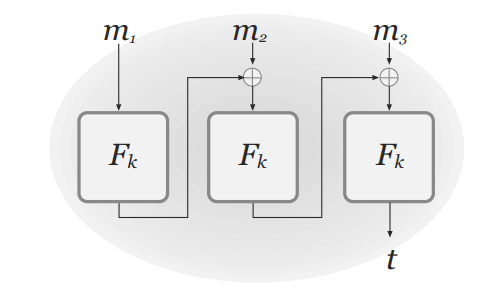

# Message Authentication Codes

- ## 4.1 - Integridade de Mensagem
	- ### 4.1.1 - Sigilo vs Integridade
		- Garantir integridade de mensagens é tão importante quanto garantir o sigilo, dependendo diretamente da aplicação e do contexto.
		- Muitos cenários necessitam que exista algum método de garantir que as mensagens recebidas (seja por um cliente ou por um servidor) foram de fato enviadas pelo dito remetente e que não foram alteradas por um terceiro.
	- ### 4.1.2 - Encriptação vs Autenticação de Mensagens
		- Encriptação com base em cifras de fluxo
			- Dado acesso à um ciphertext *c* e poder de alterá-lo, nem mesmo o sigilo perfeito garantido por um OTP é capaz de impedir que um indivíduo malicioso altere uma mensagem encriptada
		- Encriptação com cifras de bloco
			- ECB, além de não garantir nenhuma noção de sigilo, é vulnerável a alterações de bits e de ordem de blocos. 
			- CBC permite alteração do IV, e portanto, do primeiro bloco de ciphertext
- ## 4.2 - Códigos de Autenticação de Mensagem (MACs) 
	- **Definição**: Um **código de autenticação de mensagem** (**MAC**) consiste em três algoritmos PPT (**Gen**, **Mac**, **Vrfy**) tais que
		- 1. **Gen** é o algoritmo de geração de chaves que recebe um parâmetro de segurança 1n e devolve uma chave com |*k*| $\ge$ *n*.
		- 2. **Mac** é o algoritmo de geração de tag que recebe uma chave *k* e uma mensagem *m* $\in$ {0, 1}* como entrada e devolve uma tag *t*. 
			- Por poder utilizar aleatoriedade em sua construção, a notação é tida como *t* $\leftarrow$ **Mac**k(*m*)
		- 3. **Vrfy** é o algoritmo de verificação que recebe a chave *k*, a mensagem *m* e a tag *t* como entrada e devolve um bit *b* representando a validade da tag, ou seja, *b* = 1 se é válida e *b* = 0 caso contrário.
			- Por ser determinístico, escrevemos *b* $\coloneqq$ **Vrfy**k(*m*, *t*)
		- $\forall$ *n*, $\forall$ *k* $\leftarrow$ Gen(1n) e $\forall$ *m* $\in$ {0, 1}*, Vrfyk(*m*, Mack(*m*)) = 1
		- Com criptografia simétrica, o algoritmo de geração de chave Gen(1n), por definição gera chaves *k* uniformes. Portanto, pode-se omiti-lo nesse contexto
		- Nos casos em que os MACs são determinísticos, e, naturalmente, os algoritmos de geração de tag Mac() também são, o algoritmo de verificação Vrfy() apenas gera novamente uma tag *t*' e checa se *t*' = *t* para avaliar a validade. Tal estratégia é chamada de **verificação canônica**.
	- Segurança dos MACs
		- Experimento de autenticação de mensagens **Mac-forgeA, Π(*n*)**:
			- 1. Uma chave *k* é gerada a partir de **Gen(1n)**
			- 2. O adversário *A* é dado acesso ao parâmetro de segurança 1n e ao oráculo **Mack(.)**. Eventualmente, *A* devolve um par (*m*, *t*), definindo *Q* como o conjunto de todas as consultas de *A* ao oráculo.
			- 3. *A* é bem sucedido no experimento (o experimento tem saída = 1) $\iff$ (1) **Vrfy(*m*, *t*) = 1** e (2) *m* $\notin$ *Q*.
		- **Definição:** Um código de autenticação de mensagem $\Pi$ = (**Gen**, **Mac**, **Vrfy**) é **inforjável existencialmente sob um ataque adaptativo de mensagens selecionadas** (é seguro) se para todo adversário *A* PPT, existe uma função insignificante *negl* tal que **P[Mac-forgeA, Π(*n*) = 1] $\le$ *negl*(*n*)
		- Definição muito forte, mas importante para garantir que qualquer nova construção de MAC possa ser aplicado em qualquer aplicação e respectivo contexto.
		- **Ataques de repetição**
			- Ataques em que um indivíduo malicioso reenvia uma mensagem já autenticada anteriormente juntamente à sua tag.
			- Extremamente perigoso, mas a definição de MAC não consegue evitar/proteger contra tais ataques, pois a verificação é *stateless*, ou seja, a verificação de uma mensagem não é influenciada/afetada pela verificação de outra qualquer.
			- Proteção contra ataques de repetição deve ser garantida pela aplicação de alto nível que implementa o MAC
				- Pode ser garantida por contadores ou por marcações de tempo concatenadas às mensagens
		- A definição de segurança anterior garante que um adversário não consegue gerar uma tag para uma mensagem ainda não autenticada. Porém, a definição não afirma nada sobre adversários que geram uma nova tag para uma mensagem já autenticada, representando uma falha de segurança.
		- Definimos um novo experimento, baseado em uma modificação de Mac-forge, que protege contra tal formalidade: **Mac-sforgeA, Π(*n*):
			- Definido da mesma forma que Mac-forge, porém agora o conjunto *Q* guarda os pares resultantes das consultas ao oráculo **Mac**, ou seja, (*m*, *t*) $\in$ *Q* se *t* $\leftarrow$ **Mack(*m*)** em uma consulta de *A*. O adversário *A* é bem sucedido $\iff$ devolve um par (*m*, *t*) tal que **Vrfyk(*m*, *t*)** = 1 e (*m*, *t*) $\notin$ *Q*.
		- **Definição:** um código de autenticação de mensagem $\Pi$ = (**Gen**, **Mac**, **Vrfy**) é **fortemente seguro** se para todo adversário *A* PPT, existe uma função insignificante *negl* tal que **P[Mac-sforgeA, Π(*n*) = 1] $\le$ *negl*(*n*)**.
			- Se um MAC utiliza verificação canônica, ele é fortemente seguro.
		- Existem adversários que possuem acesso também à oráculos de verificação, em que podem enviar um par (*m*, *t*) e checar se **Vrfyk(*m*, *t*)** = 1. Porém, qualquer MAC que utiliza verificação canônica e portanto é fortemente seguro, mantém-se seguro perante oráculos de verificação.
		- **Ataque de temporização**
			- Suponhamos um adversário *A* com acesso à um oráculo de verificação que retorna se a tag *t* é válida e também o tempo que foi necessário para tal checagem. Se a checagem da validade da tag é feita por uma função como *strncmp* de *C*, em que cada byte das strings é comparado um por vez, é possível utilizar o tempo de execução da função para reconhecer a posição do primeiro byte diferente.
			- Se o adversário sabe os *i* primeiros bits corretos da tag *t*, pode descobrir o i+1-ésimo da seguinte forma: realiza 256 consultas ao oráculo de verificação, com 256 strings *tj* diferentes, em que a string *tj* é composta tal que os *i* primeiros bytes são os já conhecidos, o *i+1* é o valor *j* e o restante é igual 0x0. Com isso, a rotina de verificação terá um tempo de execução maior na consulta em que o byte *i+1* está correto, pois terá falhado apenas no byte *i+2*.
			- Esse *side-channel attack* foi utilizado para "exploitar" o sistema de validação de jogos originais do Xbox 360.
			- Portanto, algoritmos de verificação de MACs devem utilizar comparações de string em que todos os bytes são comparados juntamente.
- ## 4.3 - Construindo Códigos de Autenticação de Mensagem Seguros
	- ### 4.3.1 - MAC de tamanho fixo
		- É possível construir um MAC de tamanho fixo a partir de uma função pseudoaleatória *F*k, onde a tag *t* de uma mensagem *m* é obtido através de *t* $\coloneqq$ *F*k(*m*).
			- Se o tamanho da saída de *F*k é *n*, a probabilidade de chutar e acertar o valor da função em um ponto ainda não calculado é insignificantemente maior do que 2-n. Portanto, tal é a probabilidade de, com essa construção, acertar a tag *t* de uma mensagem *m* ainda não consultada.
		- **Construção:** Seja *F* uma função pseudoaleatória *length preserving*. Definimos um MAC de tamanho fixo para mensagem de tamanho *n* como:
			- **Mac:** recebe a chave *k* $\in$ {0, 1}n e uma mensagem *m* $\in$ {0, 1}n como entrada e devolve *t* $\coloneqq$ *F*k(*m*)
			- **Vrfy:** recebe a chave *k* $\in$ {0, 1}n, a mensagem *m* $\in$ {0, 1}n e tag *t* $\in$ {0, 1}n como entrada e devolve 1 $\iff$ *t* == *F*k(*m*)
	- ### 4.3.2 Expansão de Domínio para MACs
		- É possível construir um MAC para mensagens de tamanho arbitrário a partir de um MAC de mensagens de tamanho fixo *n*
		- **Construção:** Seja $\Pi$' = (**Mac'**, **Vrfy'**) um *fixed-length* MAC para mensagens de tamanho *n*. Podemos definir um MAC para mensagens de tamanho arbitrário como
			- **Mac:** recebe a chave *k* $\in$ {0, 1}n e a mensagem *m* $\in$ {0, 1}* de tamanho *l* < 2n/4 como entrada. Analisa a mensagem *m* como *d* blocos *m1*,...,*md*, cada um com tamanho *n*/4. Juntamente, escolhe um identificador uniforme de mensagem *r* $\in$ {0, 1}n/4. Para todo *i* = 1, ..., *d*, computa *ti* $\leftarrow$ **Mac'k(*r*||*l*||*i*||*mi*)**, onde *i* e *l* são representados por strings de tamanho *n*/4. Devolve a tag *t* $\coloneqq$ [*r*, *t1*, ..., *td'*].
			- **Vrfy:** recebe a chave *k* $\in$ {0, 1}n, a mensagem *m* $\in$ {0, 1}* de tamanho 0 < *l* < 2n/4 e a tag *t* = [*r*, *t1*, ..., *td'*]. Analisa a mensagem *m* como *d* blocos *m1*,...,*md*, cada um com tamanho *n*/4. Devolve 1 $\iff$ *d*' = *d* e **Vrfyk(*r*||*l*||*i*||*mi*, *ti*)** = 1 para todo 1 $\le$ *i* $\le$ *d*.
			- Se $\Pi$' é um MAC seguro para mensagens de tamanho *n*, a construção acima é um MAC seguro para mensagens de tamanho arbitrário.
		- Estratégia extremamente imprática, vide tamanho da tag gerada e número de chamadas da cifra de bloco base.
- ## 4.4 - CBC-MAC
	- **Construção:** Seja *F* uma função pseudoaleatória e fixe uma função-tamanho *l*(*n*) > 0. Um CBC-MAC pode ser construído como:
		- **Mac:** recebe como entrada *k* $\in$ {0, 1}n e a mensagem *m* de tamanho *l*(*n*) * *n*. Em seguida, analisa *m* como uma sequência de blocos *m1*,...,*ml*, com cada *mi* de tamanho *n*; e calcula *tl*, tal que *t0* $\coloneqq$ 0n e para *i* = 1,...,*l*, *ti* $\coloneqq$ *F*k(*ti-1* $\oplus$ *mi*)
		- **Vrfy:** recebe *k* $\in$ {0, 1}n, a mensagem *m* e a tag *t* como entrada. Devolve 1 $\iff$ o tamanho de *m* = *l*(*n*) * *n* e *t* == Mack(*m*).
		- Se *l* é um polinômio e *F* é uma função pseudoaleatória, a construção acima é um MAC seguro para mensagens de tamanho *l*(*n*) * *n*.
			- Nota-se que essa construção de CBC-MAC é segura para mensagens de qualquer tamanho fixo *n*. Não é segura contra mensagens de tamanho arbitrário. Portanto, deve ser utilizada apenas nos casos em que o tamanho das mensagens é pré-acordado entre remetente e destinatário.
	 
	 - É possível modificar em dois modos a construção de CBC-MAC apresentada para suportar mensagens de tamanho arbitrário:
		 - 1. Concatenar o tamanho da mensagem *m* (representado por uma string de tamanho *n*) no seu início e aplicar a construção da mesma forma que foi explicitado
		 - 2. Utilizar duas chaves ao invés de uma, tal que primeiro um tag *t* é computada normalmente com CBC-MAC através de *k1* e depois é devolvido a tag *tf* $\coloneqq$ *F*k2(*t*)
	 - // Importante acompanhar essa seção juntamente da seção 4.4.2 do livro, em que as proposições apresentadas acima e os teoremas a seguir são analisados e provados como seguros.
		 - **Teorema 4.11:** Se *F* é uma função pseudoaleatória, então CBC é uma função pseudoaleatória desde que o conjunto das entradas com as quais é consultado é *prefix-free*. Isso significa que, para qualquer adversário diferenciador *D* PPT que consulta um oráculo com um conjunto de entradas *prefix-free*, existe uma função insignificante *negl* tal que **|P[*D*CBCk(.)(1n) = 1] - P[*D*f(.)(1n) = 1]| $\le$ *negl*(*n*)
		 - **Teorema 4.12:** Fixe qualquer *n* $\ge$ 1. Para qualquer adversário diferenciador *D* que consulta seu oráculo com um conjunto de *q* entradas *prefix-free*, onde a maior entrada contêm *l* blocos, tem-se que **|P[*D*CBCg(.)(1n) = 1] - P[*D*f(.)(1n) = 1]| $\le$ (*q*2 * *l*2) / 2n**
			 - Implica no Teorema 4.11 por redução padrão entre funções aleatórias e pseudoaleatórias.
 - ## 4.5 - GMAC e Poly1305
	 - 