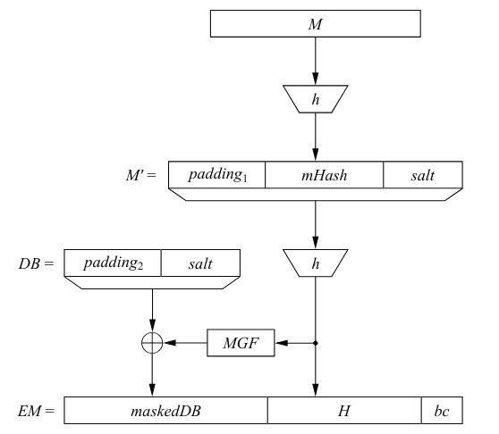

# Digital Signatures
- Esquemas de criptografia simétrica e assmétrica vistos até
então impediam que um terceiro indivíduo fora da troca de mensagens
fosse capaz de visualizar/alterar as informações trocadas.
    - Não apresentam nenhuma segurança para casos em que o indivíduo
    mal intencionado fosse um dos dois lados do esquema
- Assinaturas digitais permitem certificar de que uma mensagem 
de fato foi gerada pelo suposto indivíduo X que a enviou.
    - São uma função de uma chave privada e da própria mensagem x
        - Receptor consegue checar se foi enviada por quem esperava
        atrvés da mensagem, assinatura e chave pública recebida.
            - Impede que um indivíduo negue que enviou a mensagem
            em questão e, também, que uma pessoa maliciosa envie
            uma mensagem fingindo ser outra.

- Serviços de segurança
    - Primários
        - Confidencialidade
        - Integridade
        - Autenticação de mensagens
        - Não repudiação
    - Secundários
        - Identificação/autenticação
        - Controle de acesso
        - Disponibilidade
        - Auditoria
        - Segurança física
        - Anonimato

- Schoolbook RSA Digital Signature Protocol
    - Computar parâmetros do RSA: n = p * q, ϕ(n), e ε [1,ϕ(n)) 
    e d = e⁻¹ mod ϕ(n)
    - Autor da mensagem 'x' realiza s = xᵈ mod n e envia (x, s) para
    o receptor da mensagem, que com a chave pública e, verifica se
    x' = sᵉ mod n = x.
        - Não encripta a mensagem. Apenas garante autenticação e 
        integridade
        - Papéis invertidos do RSA
    - Na maioria das aplicações, uma assinatura é gerada apenas uma vez,
    enquanto a verificação dela é realizada múltiplas. Portanto, uma 
    chave pública pequena permite que a exponenciação da verificação
    seja um processo muito rápido.
    - Permite ataque de forgery
        - Oscar, com base na chave pública (n, e) de Bob, escolhe uma 
        assinatura s, calcula x = sᵉ mod n e envia para Alice fingindo
        ser Bob. 
        - Alice checa que sᵉ = x mod n e não consegue reconhecer que a 
        mensagem não veio de Bob
        - Oscar não tem controle sobre a mensagem x que vai ser enviada.
        - Na prática, portanto, não é muito viável. 
        - Solução é implementar padding, de modo a deixar a assinatura
        de forma probabilística.
            - Utilizam Enconding Method for Signature with Appendix (EMSA)
            Probabilistic Signature Scheme (PSS)
                - Passar a mesma mensagem por esse processo duas vezes 
                resulta em duas assinaturas completamente diferentes.

        

- Elgamal Digital Signature Scheme
    - Set-up: 
        - Semelhante ao Elgamal: primo 'p' grande, 'α' gerador de Z∗ₚ,
        chave privada aleatória 'd' ε {2, 3, ..., p - 2} e chave pública 
        β = αᵈ mod p.
    - Geração de assinatura:
        - Chave efêmera aleatória kₑ ε {0, 1, ..., p - 2} / gcd(kₑ, p - 1) = 1
        - Parâmetros 'r' = αᵏₑ mod p e 's' = (x - d * r) * kₑ⁻¹ mod (p - 1)
        - Mensagem é enviada como (x, (r, s))
    - Verificação de assinatura:
        - Cálculo de valor 't' = βʳ * rˢ mod p. Se 't' = αˣ mod p, a assinatura
        é válida. Caso contrário, inválida.
    - Segurança
        - A segurança do processo está na dificuldade de se calcular DLPs. Se 
        os parâmetros são selecionados corretamente, os ataques explicados na 
        seção do Elgamal também se tornam inviáveis.
        - Chave efêmera deve ser efêmera. Se repetida, qualquer indivúduo 
        consegue olhar e calcular a chave privada 'd' a partir dele.
        - Assim como assinatura com RSA, um atacante é capaz de gerar uma 
        mensagem aleatória com os parâmetros públicos de Bob, porém, não
        consegue ter controle do conteúdo dela.

- Digital Signature Algorithm (DSA)
    - Baseado no esquema de Elgamal
    - Set-up:
        - Primo 'p' de tamanho 2¹⁰²⁴, divisor 'q' de 'p - 1' com tamanho 2¹⁶⁰,
        elemento 'α' com ord(α) = q, inteiro 'd' aleatório com 0 < d < q, 
        β = αᵈ mod p. Chave pública, portanto, é kₚᵤ = (p, q, α, β) e a 
        privada = (d)
    - Geração de assinatura:
        - Chave efêmera aleatória com 0 < kₑ < q, elemento 'r' = (αᵏₑ mod p) mod q,
        elemento 's' = (SHA(x) + d * r) * kₑ⁻¹ mod q. Mensagem fica da forma 
        (x, (r, s)).
    - Verificação de assinatura:
        - Elemento 'w' = s⁻¹ mod q, elemento u₁ = w * SHA(x) mod q, elemento
        u₂ = w * r mod q e 'v' = (αᶸ₁ * βᶸ₂ mod p) mod q. Se 'v' = 'r' mod q,
        a assinatura é válida. Caso contrário, inválida.
    - Etapa mais custosa é a geração de chaves, pois depende da geração de 
    dois primos grandes garantindo que um seja fator do outro. Outras etapas 
    envolvem apenas exponenciações, que com pré-computação e algoritmo de
    square-and-multiply, tornam-se relativamente fáceis.
    - Segurança:
        - Envolve DLP em mod p e DLP em mod q. Portanto, ambos fatores devem
        ser escolhidos corretamente para que segurança seja garantida. Em 
        mod p, é possível aplicar index-calculus attack. Já em mod q, consegue-se 
        utilizar Pohlig-Hellman, por exemplo.
        - Novamente, se a chave efêmera não for utilizada como nonce, torna-se
        muito fácil para um atacante quebrar completamente o esquema
        - Os tamanhos de parâmetros exemplificados garantem nível de segurança
        de 2⁸⁰. Para segurança a longo prazo, ou seja, nível de 2¹²⁰, devem ser
        tais que log₂p = 3072 e log₂q = 256.